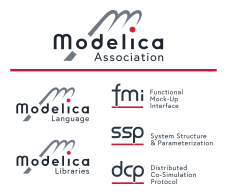

# Modelica Association Logos (MA, Language, Libraries, FMI, SSP, DCP)
This repository contains Modelica Association (MA) logos, hosted at https://github.com/modelica/MA-Logos 

## Usage guideline

  * Use *Modelica Association logo* whenever possible. This should emphasize the coordination work of Modelica Association and make clear, that Modelica Association is not only about Modelica® language.
  * When showing *multiple MA project logos*, scale all of them to the same size. Use the [x-height](https://en.wikipedia.org/wiki/X-height) measure for scaling.
  * Use the letter baseline to align multiple logos.
  * Use the following logo order (sequence of joining the MA): Language, Libraries, FMI, SSP, DCP.
  * The Modelica color scheme includes Black (&#35;1F252F), Red (&#35;DD1D30), and Grey (&#35;707984). White is defined as &#35;FFFFFF.
  * Place logos on *white background*, whenever possible. A light gray background (&#35;ECECEC) is also possible.

## MA Logos Usage Terms and Conditions
The MA logos are intellectual property of the Modelica Association. 
The Modelica Association grants you a non-exclusive, world-wide, royalty-free 
license to use these logos 
to market your own products provided that the following conditions are met.

### You are allowed to:
  * Only use the logos provided by the Modelica Association in vector graphics or bitmap graphics format.
  * Only use the logos for your printed or electronic documents or websites, if and as long as these are related to the Modelica® modeling language or other MA standards (FMI, SSP, DCP). 

### You are not allowed to:
  * Change the logos with exception of its size, while keeping the aspect ratio. In particular it is not allowed to combine the logos with other design elements, nor to incorporate it into another logos.
  * Use the logos in a manner that indicates any kind of endorsement by the Modelica Association or any kind of relationship with the Modelica Association besides the mere fact that the Modelica® language, Modelica® libraries and other standards (FMI, SSP, DCP) are developed by the Modelica Association and/or that the you are member of the Modelica Association. 

### DISCLAIMER
  * In no event shall the Modelica Association or any of its individual or organizational members be liable for any direct or indirect, incidental or consequential damages of any kind, however caused and based on any theory of liability, whether in contract, strict liability, tort (including negligence or otherwise) arising in any way from or related to the use of the MA logos, including economic damages and lost profits; regardless of whether the Modelica Association had been advised or had other reason to know of the possibility of such damage.
  * The MA logos usage agreement comes into force upon downloading the MA logos and is concluded for an unlimited period of time provided that the condition below is not applicable.
  * This License shall terminate immediately and you may no longer exercise any of the rights granted to you upon your failure to honour the conditions as given above. 
